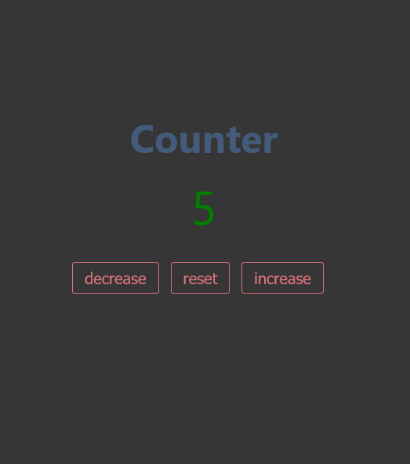

# JavaScript projects

<!-- git remote add origin git@github.com:viktishchenko/artquiz.git
/ngit psh-->

## add typescript to an existing project

[in action →](https://viktishchenko.github.io/js-projects/counter/)

[code →](../counter/)



### Step 1 — Starting the TypeScript Project

```
 mkdir typescript-project
```

```
cd typescript-project
```

```
npm i typescript --save-dev
```

```
npx tsc --init
```

#### typescript-project/tsconfig.json

```
{
  "compilerOptions": {
    "target": "es5",
    "module": "commonjs",
    "strict": true,
    "outDir": "dist",
    "sourceMap": true
  }
}
```

### Step 2 — Compiling the TypeScript Project

#### typescript-project/src/index.ts

```
const world = 'world';

export function hello(world: string = world): string {
  return `Hello ${world}! `;
}
```

```
npx tsc index.ts
```

or

```
npx tsc
```

### activate watch mode

```
npx tsc -w
```

### Step 3 — Setting Up ESLint

```
npm install eslint --save-dev
```

```
./node_modules/.bin/eslint --init
```

#### The first prompt will be:

```
? How would you like to use ESLint? …
  To check syntax only
  To check syntax and find problems
❯ To check syntax, find problems, and enforce code style
```

#### The next prompt will be:

```
 What type of modules does your project use? …
  JavaScript modules (import/export)
❯ CommonJS (require/exports)
  None of these
```

#### The next prompt will say:

```
? Which framework does your project use? …
  React
  Vue.js
❯ None of these
```

#### The next prompt will ask:

```
? Does your project use TypeScript? › No / Yes
```

Choose the Yes option.
The following prompt will say:

```
? Where does your code run? …  (Press <space> to select, <a> to toggle all, <i> to invert selection)
✔ Browser
  Node
```

The next prompt will say:

```
✔ How would you like to define a style for your project? …
❯ Use a popular style guide
  Answer questions about your style
  Inspect your JavaScript file(s)
```

The next prompt will ask:

```
√ Which style guide do you want to follow?
```

· airbnb
The next prompt will ask:

```
? What format do you want your config file to be in? …
  JavaScript
  YAML
❯ JSON
```

```
? Would you like to install them now with npm? › No / Yes
```

Choose the Yes option to install the dependencies with npm.

To use the Airbnb style guide, you will first need to install it:

```
npm install tslint-config-airbnb

```

OR

#### [Google TypeScript Style](https://github.com/google/gts)

```
npx gts init

```

#### tslint.json

```
{
    "defaultSeverity": "error",
    "extends": "tslint-config-airbnb",
    "jsRules": {},
    "rules": {
        "eofline": false,
        "no-console": "off"
    },
    "rulesDirectory": []
}
```

### Step 4 — Installing the ESLint Extension

### Step 5 — Formatting on Save

#### .vscode/settings.json

```
{
    "editor.codeActionsOnSave": {
        "source.fixAll.eslint": true
    },
    "eslint.validate": ["javascript"]
}
```

### Step 6 — Customizing ESLint Rules

#### .eslintrc.json

```
{
    "env": {
        "browser": true,
        "commonjs": true,
        "es2021": true
    },
    "extends": [
        "airbnb-base"
    ],
    "parserOptions": {
        "ecmaVersion": 12
    },
    "rules": {
    }
}
```

#### .eslintrc.json

```
"rules" : {
    "no-console": "off",
    "quotes": [
        "error",
        "double"
    ]
}
}
```

[Conclusion? no-no-no-no Docs → ](https://eslint.org/docs/rules/)
